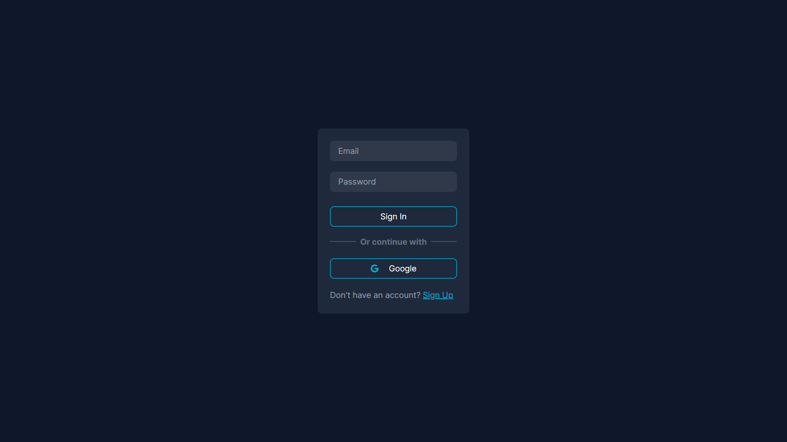
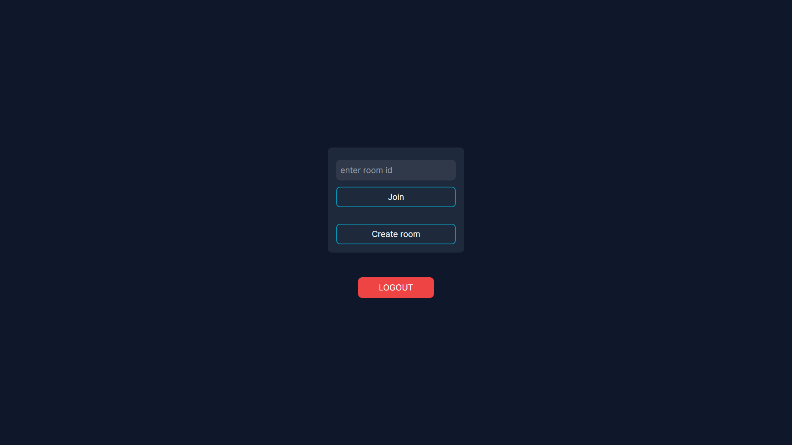
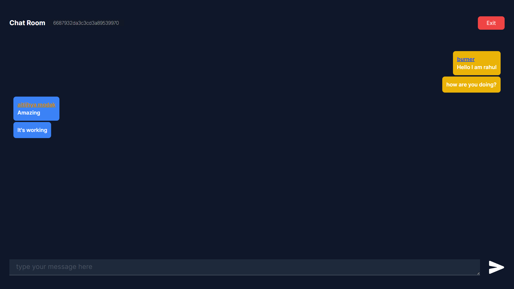

# Chat-App

## About

A real-time chat application implemented using PusherJs, where users can create rooms and chat.

Live Preview: https://am-chatapp.netlify.app

## Features

- Account system
- Realtime Chats
- Proper feedback

## Tech Stack

NextJs, TailwindCSS, Prisma, MongoDB, PusherJS

## Screenshots

